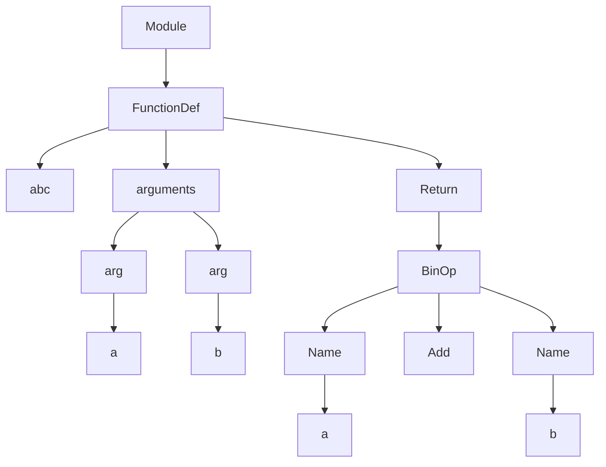

# 一个基础的 JIT 是怎么样的

<div class="grid grid-cols-3 gap-10 pt-4 -mb-6">

<v-clicks>

<div>

<v-click>

我们首先来考虑一段最简单的 Python 代码

</v-click>

```python
def add(a, b):
    return a + b
```

</div>

<div>

我们怎么样将这段代码编译成机器码呢？

</div>

<div>

我们先尝试一下手写吧

</div>

</v-clicks>

</div>

---
transition: view-transition
---

# 一个基础的 JIT 是怎么样的

<div class="grid grid-cols-3 gap-10 pt-4 -mb-6">

<v-clicks>

<div>

```python
def add(a, b):
    return a + b
```

源代码

</div>

<div>

<h1> >>> </h1>

</div>

<div>

```text
push rbp    
mov rbp, rsp
mov eax, rdi
add eax, rsi
pop rbp     
ret         
```

我们可以得到这样一段等价的汇编代码

</div>

</v-clicks>

</div>

---
transition: view-transition
---

# 一个基础的 JIT 是怎么样的

<div class="grid grid-cols-2 gap-10 pt-4 -mb-6">

<v-clicks>

<div>

```text
push rbp          ; 55
mov rbp, rsp      ; 48 89 e5
mov rax, rdi      ; 48 89 f8
add rax, rsi      ; 48 01 f0
pop rbp           ; 5d
ret               ; c3
```

我们可以根据汇编获取到最终的机器码

</div>

<div>

```python {monaco}
def test_basic_jit():
    """
    push rbp          ; 55
    mov rbp, rsp      ; 48 89 e5
    mov eax, edi      ; 89 f8
    add eax, esi      ; 01 f0
    pop rbp           ; 5d
    ret               ; c3
    """
    import mmap

    from cffi import FFI

    byte = bytearray(b"\x55\x48\x89\xe5\x48\x89\xf8\x48\x01\xf0\x5d\xc3")
    buffer = mmap.mmap(-1, len(byte), mmap.MAP_PRIVATE, mmap.PROT_READ | mmap.PROT_WRITE | mmap.PROT_EXEC)
    buffer[: len(byte)] = byte
    ffi = FFI()

    ffi.cdef("typedef int (*fn2)(int, int);")
    fn = ffi.cast("fn2", ffi.from_buffer(buffer))
    assert fn(1, 2) == 3
```

我们通过 FFI 直接调用这段机器码

</div>

</v-clicks>

</div>

---
transition: view-transition
---

# 一个基础的 JIT 是怎么样的

但是这样是不是太枯燥了一点，同时太不灵活

<div class="grid grid-cols-4 gap-10 pt-4 -mb-6">

<v-clicks>

<div>

```python {monaco}
def add(a, b):
    return a / b
```

如果我们要支持除法怎么办

</div>

<div>

```python {monaco}
def add(a, b, c):
    return a + b + c
```

如果我们要支持多个参数怎么办

</div>

<div>

我们能不能从 Python 直接编译为机器码呢

</div>

<div>

当然可以

</div>

</v-clicks>

</div>

---
transition: view-transition
---

# 一个基础的 JIT 是怎么样的

<div class="grid grid-cols-2 gap-10 pt-4 -mb-6">

<v-clicks>

<div>

```python {monaco}
def add(a, b):
    return a + b
```

这段代码的 AST 是这样的

</div>

<div>



有了 AST 我们就可以按照每个节点的行为来生成机器码

</div>

</v-clicks>

</div>

---
transition: view-transition
---

# 一个基础的 JIT 是怎么样的 

<v-clicks>


<div class="grid grid-cols-1 gap-10 pt-4 -mb-6">


```python {monaco}{ editorOptions: { wordWrap:'on'} }
ffi = FFI()

ffi.cdef(
    """
    typedef double (*fn1)(double);
    typedef double (*fn2)(double, double);
    typedef double (*fn3)(double, double, double);
"""
)


class CompiledFunction:
    def __init__(self, args_len, code):
        self.memory_buffer = mmap.mmap(
            -1, len(code), mmap.MAP_PRIVATE, mmap.PROT_READ | mmap.PROT_WRITE | mmap.PROT_EXEC
        )
        self.memory_buffer[: len(code)] = code
        fnc_type = f"fn{args_len}"
        self.fn = ffi.cast(fnc_type, ffi.from_buffer(self.memory_buffer))

    def __call__(self, *args):
        return self.fn(*args)


class RegisterAllocator:
    REGISTERS = (
        FunctionAssembler.xmm0,
        FunctionAssembler.xmm1,
        FunctionAssembler.xmm2,
        FunctionAssembler.xmm3,
        FunctionAssembler.xmm4,
        FunctionAssembler.xmm5,
        FunctionAssembler.xmm6,
        FunctionAssembler.xmm7,
        FunctionAssembler.xmm8,
        FunctionAssembler.xmm9,
        FunctionAssembler.xmm10,
        FunctionAssembler.xmm11,
        FunctionAssembler.xmm12,
        FunctionAssembler.xmm13,
        FunctionAssembler.xmm14,
        FunctionAssembler.xmm15,
    )

    def __init__(self):
        self._registers = list(reversed(self.REGISTERS))
        self.vars = defaultdict(self._allocate)

    def _allocate(self):
        try:
            return self._registers.pop()
        except IndexError as e:
            raise NotImplementedError("Too many variables: register spilling not implemented") from e

    def get(self, var):
        return self.vars[var]


class AstCompiler:
    def __init__(self, source_code):
        self.tree = ast.parse(textwrap.dedent(source_code))
        self.assembler = None
        self.reg_allocator = None

    def show(self):
        return ast_to_mermaid(self.tree)

    def _new_func(self, name, args_names):
        self.assembler = FunctionAssembler(name, args_names)
        self.reg_allocator = RegisterAllocator()
        for name in args_names:
            self.reg_allocator.get(name)
        self.tmp0 = self.reg_allocator.get("__scratch_register_0__")
        self.tmp1 = self.reg_allocator.get("__scratch_register_1__")

    def visit(self, node):
        methname = node.__class__.__name__
        meth = getattr(self, methname, None)
        if meth is None:
            raise NotImplementedError(methname)
        return meth(node)

    def Module(self, node):
        for child in node.body:
            self.visit(child)

    def FunctionDef(self, node):
        assert not self.assembler, "cannot compile more than one function"
        argnames = [arg.arg for arg in node.args.args]
        self._new_func(node.name, argnames)
        for child in node.body:
            self.visit(child)
        # return 0 by default
        self.assembler.PXOR(self.assembler.xmm0, self.assembler.xmm0)
        self.assembler.RET()

    def Pass(self, node):
        pass

    def Return(self, node):
        self.visit(node.value)
        self.assembler.popsd(self.assembler.xmm0)
        self.assembler.RET()

    def Num(self, node):
        self.assembler.MOVSD(self.tmp0, self.assembler.const(node.n))
        self.assembler.pushsd(self.tmp0)

    def BinOp(self, node):
        OPS = {
            "ADD": self.assembler.ADDSD,
            "SUB": self.assembler.SUBSD,
            "MULT": self.assembler.MULSD,
            "DIV": self.assembler.DIVSD,
        }
        opname = node.op.__class__.__name__.upper()
        self.visit(node.left)
        self.visit(node.right)
        self.assembler.popsd(self.tmp1)
        self.assembler.popsd(self.tmp0)
        OPS[opname](self.tmp0, self.tmp1)
        self.assembler.pushsd(self.tmp0)

    def Name(self, node):
        reg = self.reg_allocator.get(node.id)
        self.assembler.pushsd(reg)

    def compile(self):
        self.visit(self.tree)
        assert self.assembler is not None, "No function found?"
        code = self.assembler.assemble_and_relocate()
        return CompiledFunction(self.assembler.nargs, code)
```


</div>

</v-clicks>

---
transition: view-transition
---

# 一个基础的 JIT 是怎么样的 

现在让我们来思考一下，这样的 JIT 有什么缺点是什么？

<v-clicks>

核心在于我们需要手动实现完整的 AST 解析，才能保证对语法的兼容性（PyPy 是个反例）

那么我们有没有什么办法更方便的实现 JIT 呢？

让我们 callback 一下之前的内容，复习下解释型语言的的核心特征

</v-clicks>

---
transition: view-transition
---

# 一个基础的 JIT 是怎么样的 

<div class="grid grid-cols-4 gap-10 pt-4 -mb-6">

<v-clicks>

<div>

解释型语言核心特征之一：有一套平台无关的抽象

</div>

<div>

在 Python 中，Python 有一套自己的抽象

</div>

<div>

以之前的函数为例

```text {monaco}

LOAD_FAST_LOAD_FAST      1 (a, b)
BINARY_OP                0 (+)
RETURN_VALUE

```

</div>

<div>

那么我们只需要将对应的字节码转换为机器码即可

</div>

</v-clicks>

</div>

---
transition: view-transition
---

# 一个基础的 JIT 是怎么样的 

<div class="grid grid-cols-1 gap-10 pt-4 -mb-6">

But How? ~~手写?~~

</div>