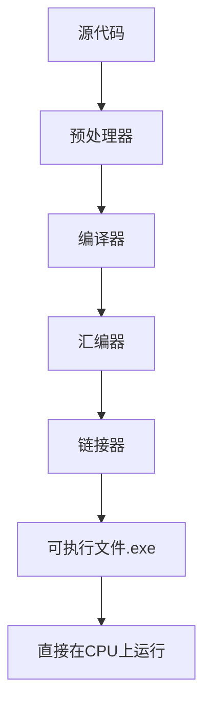
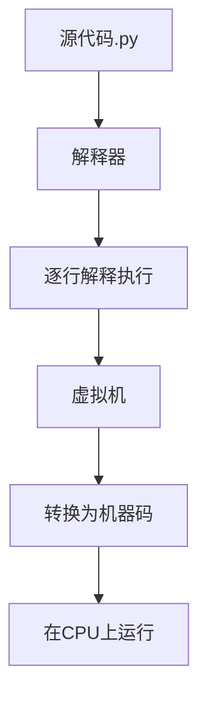

# 什么是 JIT

聊 JIT 之前，我们先来聊聊两种执行代码的方式

<v-clicks>

<v-click>

<Transform :scale=0.5>

</Transform>

</v-click>

<v-click>

<Transform :scale=0.6>

</Transform>

</v-click>

</v-clicks>

---
transition: view-transition
---

# 什么是 JIT

OK 我们现在来重点聊聊解释器的部分

<v-clicks>

1. 和编译语言一样，同样会经历编译等过程
2. 最终执行的也是机器码
3. 核心之一在于解释器单独有一套运行时抽象
4. 核心之二解释器是运行时交由解释器逐行解释执行的

</v-clicks>

<Transform :scale=0.6>

</Transform>

---
transition: view-transition
---

# 什么是 JIT

现在都来说说金坷垃（解释型语言）的好处都有啥

<v-clicks>

<v-clicks>

1. 解释器所做的平台无关的抽象让跨平台编程变得更容易

2. 能做很多很有趣的 runtime only 的花活（元编程/运行时反射等）

</v-clicks>

<h1>那么缺点呢？</h1>

<h1>慢！</h1>

</v-clicks>

---
transition: view-transition
---
# 什么是 JIT

<v-clicks>

<h1>所以能不能结合两者的优点呢？</h1>

<h1>答案是可以的！</h1>

<h1>Just In Time Compilation</h1>

</v-clicks>

---
transition: view-transition
---
# 什么是 JIT

JIT 的核心特征

<v-clicks>

1. Language runtime 根据代码执行情况，将热点代码编译为机器码
2. 编译后的机器码直接在 CPU 上运行
3. JIT 后的代码存在退化机制

</v-clicks>

---
transition: view-transition
---

# 什么是 JIT

那么我们怎么样去实现一个最简单的将动态语言编译为机器码的 JIT 呢？